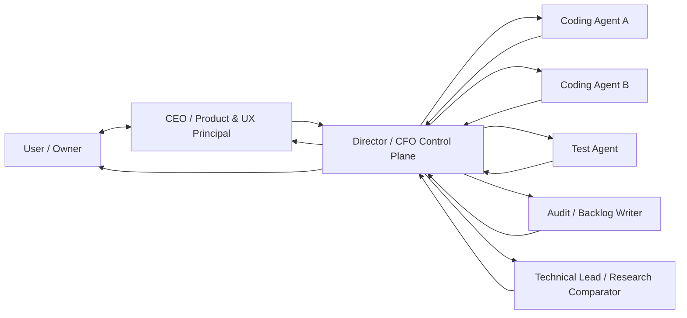

# Datapass Project Control Plane

This directory is the coordination source of truth for the Datapass V4 consumer-validation programme. It does not replace consumer-local QA/reuse/gap reports or Git history. It records cross-repository state, decisions, evidence, priorities and handoffs.

## Operating loop

The Director does not become the implementation tech lead by default. The Technical Lead challenges architecture and compares current external libraries/web practice. The CEO captures the user's product philosophy, screenshots, likes/dislikes and front-end experience. The Director reconciles both into bounded execution.

## Canonical files

- `CURRENT_PROJECT_STATE.md` — what is known now, what is uncertain, and the active decision horizon.
- `MASTER_BACKLOG.md` — project-level backlog and deferrals.
- `REPOSITORY_STATE.md` — exact repository/commit ledger.
- `ROLE_AND_DECISION_MODEL.md` — authority and evidence flow.
- `ARCHIVE_MANIFEST.md` — archive policy and snapshot contents.
- `templates/TECH_LEAD_RESEARCH_PACKET.md` — required comparative research deliverable.
- `templates/CEO_PRODUCT_UX_PACKET.md` — required user/product/consumer audit deliverable.
- `templates/AGENT_CYCLE_REPORT.md` — normalized execution/test/audit return format.

## Archive policy

Create a dated ZIP only at a meaningful checkpoint: architecture decision, framework promotion, consumer release, major audit, or backlog reset. Keep source Markdown in Git and use ZIPs as immutable handoff snapshots, not as the only copy of project truth.

Archive name: `DATAPASS_PROJECT_CONTROL_YYYY-MM-DD_CYCLE_XX_<label>.zip`.

Never silently convert candidate evidence into canonical/release-verified status inside an archive.
